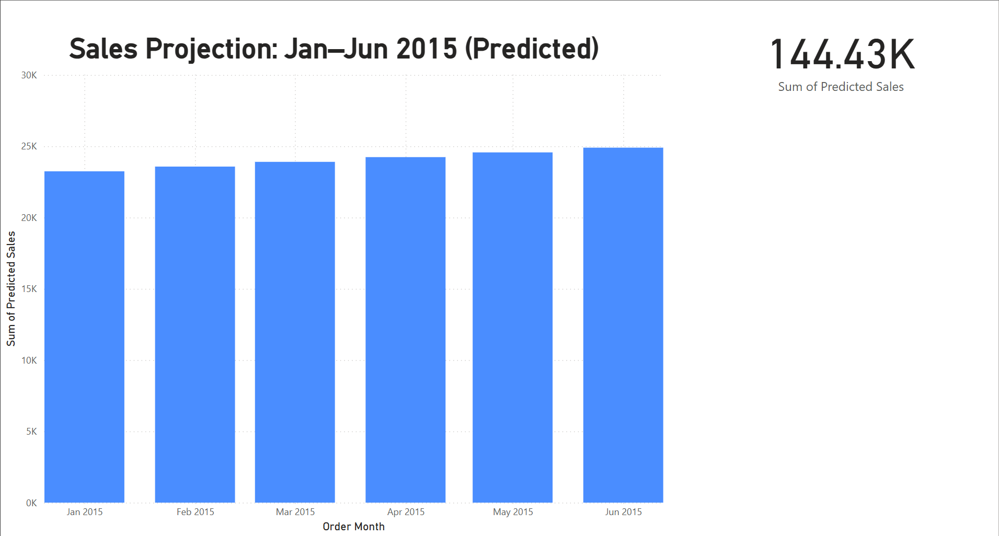

Amazon Sales Data Analysis Project

  

🔗 [👉 Click to View the Live Power BI Dashboard](https://app.powerbi.com/view?r=eyJrIjoiZjQwZjBmNzYtZjE0OS00NDJhLTgwMzItNmM5NGJjOTcwYWYzIiwidCI6IjEwMWRhNTg3LTE4NDMtNGY1Mi04YjhhLTE3YjA2OWM2NmQzMyIsImMiOjJ9)  
*(Interactive — opens in browser, no login required)*

---

❀Overview
This project explores an Amazon sales dataset to uncover business insights through data analysis and visualization. The dataset includes order-level information such as order date, shipping date, customer ID, category, product, location, quantity, sales, and profit.

The goal is to analyze key sales and profitability metrics, identify top-performing products and regions, examine customer behavior, and predict future sales trends.

❀Tools Used
Python (Pandas, Matplotlib, Seaborn, Statsmodels)

Power BI (for interactive dashboard and geographic visualizations)

Jupyter Notebook

Git & GitHub

❀Key Business Questions Answered

What is the highest selling category?

Which month has the best sales performance?

Which city has the highest and lowest total sales?

Which category has the highest profit?

Who are the top shoppers?

What are the total sales and total profits?

Which state generates the highest profit?

Which cities have high sales but low profits?

What is the average sales and profit per order?

How long does it take to ship orders by category and by state?

Can we predict the next 6 months of sales using time series forecasting?

❀Visualizations
Bar charts: Top categories, top cities, top customers

Line chart: Monthly sales trend

Forecasting: 6-month sales prediction using time series

Power BI Map: Sales and profit by state

Shipping delay comparisons by category and state

###  Power BI Dashboard Highlights

This project includes an interactive Power BI dashboard with the following pages:

- **City Sales Map**
- **Cities Sale & Profit Comparison**
- **Categories Sale & Profit**
- **6-Month Sales Forecast**
🔗 **Live Dashboard** → [Click to View in Power BI](https://...)
*(Opens in browser — no login required)*

> **Forecast Insight**:  
> Projected total sales from Jan–Jun 2015 = **144.43K**  
> Sales show a steady upward trend, indicating consistent demand and business stability.

❀Key Insights
Home appliances and phones are among the top-selling categories.

California generates the highest profit; Oregon and Arizona have high sales but negative profits.

Average shipping time varies widely by state and category.

December is the peak month for sales.

Forecasting suggests a stable increase in future monthly sales.

amazon-sales-analysis/
│
├── data/
│   └── amazon_sales.csv
│
├── notebooks/
│   └── analysis.ipynb
│
├── visuals/
│   ├── category_sales_bar.png
│   ├── state_shipping_delay.png
│   └── 6month_forecast.png
│
├── PowerBI/
│   └── Amazon_Sales_Dashboard.pbix
│
└── README.md

---

❀###  Next Steps

Further enhancements that could be implemented to expand this project:

-  **Add customer segmentation or customer lifetime value (CLV)** analysis to identify high-value customers.
-  **Apply clustering or recommendation algorithms** to personalize product offers or detect hidden patterns.
- ⚙ **Automate reporting using Power BI Service** with scheduled refresh and email subscription delivery.

